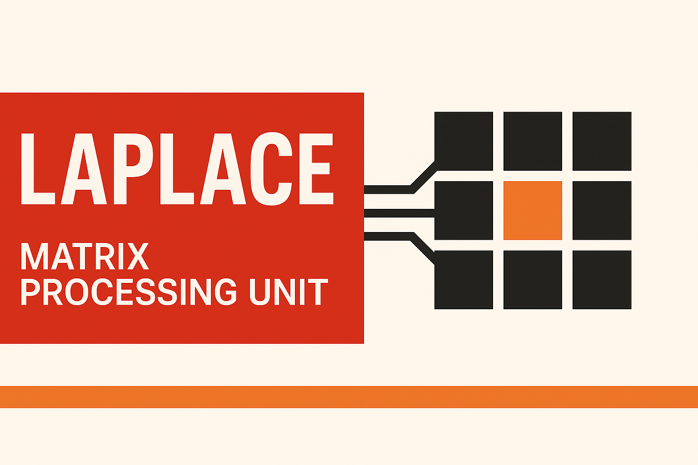

# Laplace MPU (v2)

<div style="position: relative; width: 100%; padding-top: 56.25%;">
  
</div>

## How to compile

```
gcc -std=c99 -Iapp -Ilib app/main.c lib/laplace.s -o laplace
```

* Observations: You must include both `app/` and `lib/` folder to compile it.
