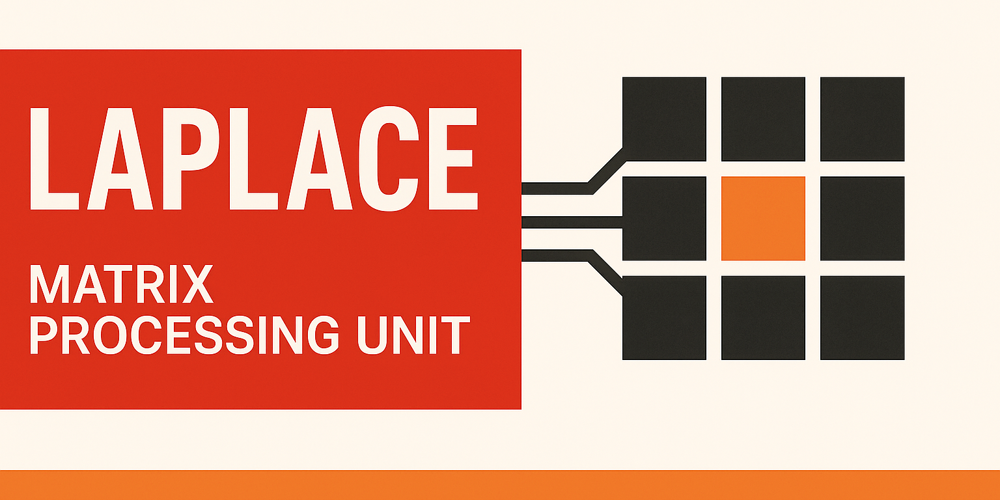

# Coprocessador Matricial com FPGA e Interface C99



Este relatório documenta, em detalhes, o desenvolvimento de um **sistema completo de processamento matricial baseado em FPGA**, envolvendo três camadas principais:

* Um **coprocessador programado em Verilog**, implementado em um kit DE1-SoC, capaz de executar operações matemáticas sobre matrizes 5×5 com inteiros de 8 bits.
* Uma **biblioteca em C/Assembly**, que funciona como driver e interface de controle entre o processador ARM (HPS) e a FPGA.
* Uma **aplicação interativa em C99**, baseada em terminal, que permite ao usuário carregar arquivos, selecionar operações e visualizar os resultados.

O projeto prioriza **baixo nível, eficiência e robustez**, promovendo a integração direta entre software e hardware por meio de registradores mapeados em memória. Ao longo deste documento, cada componente é abordado separadamente, com explicações técnicas e exemplos práticos de uso, desde a FSM do hardware até a lógica de parsing da DSL do usuário.

## Como compilar

```bash
gcc -std=c99 -Iapp -Ilib app/main.c lib/laplace.s -o laplace
```

*Observações: Você deve incluir as pastas `app/` e `lib/` para compilá-lo.*

## Baixando pre-compilado

Na aba [Releases](https://github.com/cldaniel101/pbl2-sistemas-digitais/releases) é possível ver dois arquivos, um arquivo zip, que contém o projeto Quartus pré-compilado e o binário da aplicação em C compilado para Linux ARMv7.

---

## 👥Equipe

* Cláudio Daniel Figueredo Peruna
* Paulo Gabriel da Rocha Costa Silva
* Paulo Henrique Barreto Dantas

---

## 📌 Sumário  

- [Visão Geral da Arquitetura](#1-visão-geral-da-arquitetura)  
- [Interface Host ↔ FPGA](#2-interface-host-fpga)  
- [Máquina de Estados Finita (FSM)](#3-máquina-de-estados-finita-fsm)  
- [Handshake e Protocolo de Comunicação](#4-handshake-e-protocolo-de-comunicação)  
- [Feedback Visual por LEDs](#5-feedback-visual-por-leds)  
- [Driver em C + Assembly](#6-driver-em-c-assembly)  
- [Aplicação de Usuário (C99 CLI)](#7-aplicação-de-usuário-c99-cli)  
- [Testes e Estratégias de Depuração](#8-testes-e-estratégias-de-depuração)  
- [Tabela-Resumo de Sinais](#9-tabela-resumo-de-sinais) <br> <br>

---

## 1. Visão Geral da Arquitetura

O atual projeto implementa um **ecossistema embarcado completo** voltado para o processamento de operações matriciais por meio de um coprocessador dedicado implementado em FPGA. Para alcançar esse objetivo, a solução foi dividida em **três grandes blocos interdependentes**, cada qual com uma responsabilidade bem definida:

---

### 1.1 Coprocessador (FPGA)

O coração do projeto é o coprocessador, uma unidade lógica programada em **Verilog** e sintetizada em uma **FPGA do kit DE1-SoC**. Este coprocessador é capaz de realizar, de maneira totalmente paralela, **operações matriciais sobre matrizes 5×5 de inteiros com sinal de 8 bits**.

Entre suas características mais relevantes, destacam-se:

* **Pipeline de operações**: o processamento não ocorre de forma monolítica, mas é dividido em estágios sequenciais (ex: carregamento das matrizes A e B, execução da operação, exportação do resultado).
* **Modularidade via FSM (Finite State Machine)**: toda a operação é controlada por uma máquina de estados clara e bem definida, que responde a comandos específicos vindos do host.
* **Interface binária controlada**: a comunicação com o host se dá via dois registradores mapeados em memória, `pio_out[31:0]` (entrada) e `pio_in[31:0]` (saída), controlados pelo barramento leve HPS–FPGA.

Essa separação entre entrada e saída garante que o coprocessador possa operar de forma previsível e síncrona, obedecendo a comandos e reconhecendo confirmações do host via pulsos bem definidos.

---

### 1.2 Biblioteca Driver (Assembly + C)

Para permitir que um programa em C consiga se comunicar com o coprocessador, foi desenvolvida uma **biblioteca híbrida** contendo:

* Um **cabeçalho em C** (`laplace.h`) com constantes, tipos e protótipos de funções.
* Trechos **implementados em Assembly ARMv7**, especialmente os que manipulam diretamente os registradores de controle da FPGA (por exemplo, escritas bit-a-bit nos registradores `cmd` e `stat`).

Essa biblioteca atua como uma **ponte transparente** entre o alto nível (aplicação C) e o baixo nível (registradores físicos da FPGA), abstraindo detalhes complexos como:

* Aritmética de ponteiros para mapear memória física via `/dev/mem`
* Envio de instruções codificadas em 32 bits
* Sincronização por delay microcontrolado e pulsos de "avança estágio"

Ela foi pensada para ser **mínima, segura e previsível**. Com poucos arquivos, consegue encapsular toda a lógica de comunicação, oferecendo ao programador funções fáceis de usar como `mpu_store()`, `mpu_load()` e `next_stage()`.

---

### 1.3 Aplicação do Usuário (C99)

O terceiro bloco do projeto é a interface de linha de comando, escrita em **C99**, que permite ao usuário interagir com o coprocessador de maneira intuitiva. Essa aplicação é composta por vários arquivos modulares:

* `main.c` — loop principal, inicialização da conexão e chamada das funções da biblioteca
* `parser.c` / `parser.h` — leitura e validação de arquivos `.lp` que representam matrizes ou escalares
* `ui.c` / `ui.h` — interação com o terminal, prints e mensagens de erro
* `types.h` — tipos auxiliares e enums que representam as operações

Destaque especial vai para o uso de uma **DSL (Domain Specific Language)** chamada *Laplace*, que facilita a entrada de dados pelo usuário. A linguagem permite:

* Representação textual simples de matrizes e escalares
* Comentários inline e sintaxe tolerante a erros
* Detecção automática de tamanho da matriz
* Validação detalhada com mensagens amigáveis

A escolha pelo padrão **C99** foi deliberada. O projeto se beneficia de recursos como:

* Tipos de largura fixa (`int8_t`, `uint32_t`, etc.)
* Declarações dentro de blocos
* Melhor suporte à modularização
* Legibilidade e segurança de tipo

Isso tudo contribui para que o código da aplicação seja mais robusto, moderno e fácil de manter, especialmente em comparação com o antigo padrão C89.

---

### 1.4 Comunicação entre os blocos

A comunicação entre os três blocos ocorre em **camadas bem delimitadas**:

```text
Usuário
  ⇅ (input via terminal)
Aplicação C99
  ⇅ (via structs e funções)
Driver (C + Assembly)
  ⇅ (via registradores mapeados)
FPGA (Verilog)
```

Essa separação favorece **testes modulares** (cada parte pode ser validada independentemente), bem como **portabilidade** (o software poderia se adaptar a outro hardware mantendo a mesma interface de driver).

---

## 2. Interface Host ↔ FPGA

A interface entre o host (um processador ARM embarcado no HPS do DE1-SoC) e o coprocessador (implementado na FPGA) é feita por meio de dois **registradores de 32 bits mapeados em memória**, acessados via o *Lightweight HPS–FPGA Bridge*:

* **`pio_out[31:0]`**: registrador de **entrada** – envia comandos e dados do host para o coprocessador.
* **`pio_in[31:0]`**: registrador de **saída** – recebe os dados de volta do coprocessador para o host.

Esses registradores são acessados diretamente através de ponteiros `volatile` em C e Assembly, garantindo total controle e baixa latência.

---

### 2.1 Registrador de Entrada – `pio_out[31:0]`

O registrador `pio_out` é onde o host escreve instruções para o coprocessador. Ele é dividido em campos com significados específicos:

| Bits      | Campo             | Função                                                                                                      |
| --------- | ----------------- | ----------------------------------------------------------------------------------------------------------- |
| **31**    | `start_pulse`     | Pulso de início (1 ciclo). Dispara carregamento ou execução, dependendo do estágio atual.                   |
| **30**    | `matrix_size_reg` | Define o tamanho lógico da matriz: `0` = 3×3, `1` = 2×2. Usado somente na operação determinante.            |
| **29–27** | `op_code`         | Código da operação a ser executada. Decodificado internamente pela FSM para selecionar a lógica apropriada. |
| **26**    | `ack_pulse`       | Pulso de confirmação de leitura: o host informa que já processou o dado recebido.                           |
| **25–9**  | (reservado)       | Não utilizados. Sempre escritos como zero para evitar efeitos indesejados.                                  |
| **8–1**   | `bit_pos`         | Posição de 0 a 199 que indica qual bit está sendo gravado em Matrix\_A ou Matrix\_B.                        |
| **0**     | `bit_val`         | Valor binário (0 ou 1) que será gravado na posição indicada por `bit_pos`.                                  |

#### **Resumo Prático**

O registrador `pio_out` permite o carregamento completo das duas matrizes A e B, bit a bit, além de configurar a operação desejada e sinalizar o avanço entre estágios com pulsos de controle. A lógica no Verilog faz detecção de borda para `start_pulse` e `ack_pulse`, simplificando o protocolo: basta escrever um "1" por um ciclo para disparar a ação correspondente.

---

### 2.2 Registrador de Saída – `pio_in[31:0]`

Já o `pio_in` é utilizado pelo coprocessador para informar o progresso da operação e entregar os resultados, estruturado da seguinte forma:

| Bits      | Campo           | Função                                                                    |
| --------- | --------------- | ------------------------------------------------------------------------- |
| **31**    | `flag_reg`      | Flag de novo dado: quando `1`, indica que há um byte pronto para leitura. |
| **30–26** | `byte_idx`      | Índice do byte atual dentro do vetor de saída Result\[199:0].             |
| **25–8**  | Zeros (`18'd0`) | Preenchimento fixo para completar os 32 bits.                             |
| **7–0**   | `data_out_reg`  | O byte efetivo de resultado (parte da matriz calculada).                  |

#### **Resumo Prático**

A comunicação é orientada a **bytes sequenciais**: a matriz final de 25 bytes é transmitida do coprocessador para o host um byte por vez. Para cada byte, o FPGA sinaliza que há dado disponível (`flag_reg = 1`). O host responde com `ack_pulse`, fazendo o byte seguinte ser colocado no barramento. A contagem `byte_idx` ajuda o host a controlar o progresso da leitura.

---

### 2.3 Diálogo Resumido entre Host e FPGA

```text
(Host) Envia bits de A → `bit_val`, `bit_pos`, `start_pulse`
(Host) Envia bits de B → idem
(Host) Define `op_code`, `matrix_size_reg`, envia novo `start_pulse`
(FPGA) Executa operação
(FPGA) Coloca byte de resultado em `data_out_reg`, aciona `flag_reg`
(Host) Lê byte, envia `ack_pulse`
↻ Repete até `byte_idx == 24`
```

---

### 2.4 Vantagens dessa Interface

* **Eficiência binária**: O protocolo usa poucos bits com significados claros, evitando overhead de comunicação.
* **Controle total**: O host tem domínio total sobre o ritmo da operação, inclusive podendo interromper e reiniciar.
* **Simplicidade no hardware**: O uso de borda e pulsos binários simplifica a FSM do Verilog e evita bugs de latch ou sinal mantido.

---

### 2.5 Limitações e Potenciais Extensões

* A interface é projetada **somente para matrizes 5×5 (200 bits)**. Outros tamanhos exigiriam mudanças tanto no FSM quanto na lógica de envio e leitura.
* Os bits `25:9` reservados podem futuramente acomodar:

  * Flags de saturação, overflow ou underflow
  * Configurações de ponto flutuante
  * Operações com mais de duas matrizes ou com máscara condicional

---

## 3. Máquina de Estados Finita (FSM)

A FSM (Finite State Machine) é uma estrutura de controle sequencial implementada em Verilog que **orquestra o comportamento do coprocessador**. Ela age como um “diretor de cena”, garantindo que cada módulo execute sua função no momento certo e com os sinais apropriados.

A FSM responde a comandos recebidos via `pio_out` e avança por **cinco estados principais**, garantindo sincronização e segurança na execução da operação matricial.

---

### 3.1 Estados da FSM

| Código | Nome do Estado | Função Principal                               | Ação de Saída / Comportamento                                        | Condição de Transição                      |
| ------ | -------------- | ---------------------------------------------- | -------------------------------------------------------------------- | ------------------------------------------ |
| `000`  | **IDLE**       | Estado inicial. Espera o comando para começar. | Lê `op_code` e `matrix_size_reg`, zera variáveis de controle.        | Pulso em `start_pulse` → **LOAD\_A**       |
| `001`  | **LOAD\_A**    | Carrega 200 bits da matriz A, bit a bit.       | Armazena cada bit em `Matrix_A` com base em `bit_pos` e `bit_val`.   | Quando `load_cnt == 199` → **LOAD\_B**     |
| `010`  | **LOAD\_B**    | Carrega 200 bits da matriz B.                  | Idêntico a A, mas escreve em `Matrix_B`.                             | Quando `load_cnt == 199` → **EXEC\_OP**    |
| `011`  | **EXEC\_OP**   | Executa a operação com base no `op_code`.      | Ativa módulo `MpuOperations`; conta 7 ciclos para garantir latência. | Quando `cycle_counter > 6` → **READ\_RES** |
| `100`  | **READ\_RES**  | Exporta resultado da operação, byte a byte.    | Gera `data_out_reg`, levanta `flag_reg`, aguarda `ack_pulse`.        | Se `byte_idx == 24` → **IDLE**             |

---

### 3.2 Transição Completa dos Estados

A FSM segue a seguinte cronologia linear com laços internos bem definidos:

```text
IDLE ──start_pulse──▶ LOAD_A (200 ciclos)
       └── (bit-a-bit com pio_out)
          ↓
LOAD_B (200 ciclos)
       └── (bit-a-bit com pio_out)
          ↓
EXEC_OP (~7 ciclos)
       └── (executa operação combinacional/sequencial)
          ↓
READ_RES (25 ciclos)
       └── (handshake byte-a-byte com pio_in ↔ ack_pulse)
          ↓
IDLE ─── (espera novo start_pulse para nova operação)
```

---

### 3.3 Segurança de Transição

A FSM é protegida contra comandos fora de ordem. Por exemplo:

* Se o host enviar um novo `start_pulse` durante `READ_RES`, a FSM **retorna para IDLE**, abortando a operação — isso evita conflitos ou leituras truncadas.
* Cada `ack_pulse` só é aceito se vier **depois** de `flag_reg` ser levantado, mantendo a integridade da troca de dados.

---

### 3.4 Visibilidade via LEDs

Três LEDs físicos da placa FPGA são utilizados como **indicadores visuais de estado**, úteis para debug e demonstrações:

| LED | Estado Ativado | Significado                      |
| --- | -------------- | -------------------------------- |
| 0   | `LOAD_A`       | "Carregando Matriz A"            |
| 1   | `LOAD_B`       | "Carregando Matriz B"            |
| 2   | `READ_RES`     | "Enviando Resultado para o Host" |

Estes LEDs acendem automaticamente quando a FSM entra no estado correspondente, ajudando a monitorar o fluxo em tempo real sem ferramentas de depuração sofisticadas.

---

### 3.5 Características Técnicas

* **Contadores internos**: usados para controlar o número de bits recebidos e o número de ciclos de execução.

  * `load_cnt`: conta até 199 durante LOAD\_A e LOAD\_B.
  * `cycle_counter`: conta até 6 durante EXEC\_OP.
  * `byte_idx`: percorre de 0 a 24 durante READ\_RES.
* **Modularidade**: cada estado tem lógica separada, permitindo fácil extensão ou modificação (ex: para adicionar novos estágios).

---

## 4. Handshake e Protocolo de Comunicação

Durante o estágio final da execução – o estado **`READ_RES`** da FSM – o coprocessador envia os dados da matriz-resultado de volta ao host **um byte por vez**. Esse processo é cuidadosamente sincronizado através de um **protocolo de handshake**, que garante:

* Que o FPGA **não sobrescreva dados** antes que o host os leia.
* Que o host **saiba exatamente quando um novo byte está pronto**.
* Que os dois lados avancem **em total sincronia**, evitando perda de dados.

---

### 4.1 O Papel de Cada Sinal

Durante o `READ_RES`, os seguintes sinais e registradores são utilizados:

| Sinal           | Direção | Papel durante o Handshake                                     |
| --------------- | ------- | ------------------------------------------------------------- |
| `Result[199:0]` | Interno | Vetor com os 200 bits da matriz de resultado.                 |
| `byte_idx`      | Interno | Índice que controla qual byte está sendo enviado (0 a 24).    |
| `data_out_reg`  | Saída   | Armazena o byte atual que será lido pelo host.                |
| `flag_reg`      | Saída   | Quando 1, indica que `data_out_reg` está pronto para leitura. |
| `ack_pulse`     | Entrada | Pulso do host confirmando que o byte foi lido.                |

---

### 4.2 Passo a Passo do Handshake

#### **1. FPGA prepara o dado**

Ao entrar em `READ_RES`, a FSM fatiará o vetor de resultado em 25 blocos de 8 bits. Para cada byte:

```verilog
data_out_reg <= Result[byte_idx*8 +: 8];
flag_reg     <= 1;   // Sinaliza ao host: "byte disponível"
```

→ O host verifica o bit 31 de `pio_in` (`flag_reg == 1`) e sabe que há dado novo.

---

#### **2. Host consome o dado**

O host lê o valor de `pio_in[7:0]` (conteúdo de `data_out_reg`), armazena em sua RAM e então envia:

```c
pio_out = (1 << 26); // ack_pulse = 1
```

→ Esse pulso de confirmação é capturado pelo hardware por detecção de borda.

---

#### **3. FPGA avança**

Após detectar o pulso, a FSM limpa o flag e avança para o próximo byte (ou retorna a IDLE):

```verilog
flag_reg <= 0;
if (byte_idx == 24)
    state <= IDLE; // todos os bytes enviados
else
    byte_idx <= byte_idx + 1;
```

---

#### **4. Repetição**

Esse ciclo se repete **25 vezes**, exatamente um por byte, até que todos os dados da matriz sejam entregues ao host.

---

### 4.3 Diagrama Temporal Simplificado

```text
Clock →
FPGA: flag_reg = 1   ─────────────┐
Host: lê dado         ─────────┐  │
Host: ack_pulse = 1            │  │
FPGA: flag_reg ← 0             │  │
FPGA: byte_idx++               └──┘
```

Cada par `flag_reg↑` → `ack_pulse↑` representa **uma iteração do handshake**. Nenhum dado é sobrescrito sem confirmação.

---

### 4.4 Robustez e Tolerância a Erros

A FSM está preparada para proteger a integridade dos dados:

* **Start precoce?** Se o host acionar `start_pulse` fora de hora, a FSM reseta para `IDLE`, **abandonando a leitura** e reiniciando a operação – evitando vazamentos ou dados fora de ordem.
* **Flag ignorado?** Sem `ack_pulse`, o FPGA **não avança**. Isso significa que se o host travar, a operação pausa, não falha silenciosamente.
* **Reenvio?** O protocolo atual **não prevê retransmissão**, mas a estrutura permite fácil inclusão de CRC ou verificação de integridade.

---

## 5. Feedback Visual por LEDs

Durante a operação do sistema, o coprocessador implementado na FPGA **acende LEDs físicos** para indicar em qual estado da FSM ele se encontra. Esses LEDs estão conectados diretamente aos pinos da placa DE1-SoC e são acionados **com base no valor atual do estado**, permitindo que qualquer pessoa — mesmo sem terminal ou console — **acompanhe o fluxo da execução visualmente**.

---

### 5.1 Finalidade dos LEDs

O uso de LEDs no projeto serve a três propósitos:

1. **Depuração prática**: em caso de falhas ou travamentos, o LED aceso indica em qual fase o sistema parou.
2. **Confirmação de funcionamento**: durante apresentações, ver os LEDs piscando conforme o esperado reforça que o sistema está operando corretamente.
3. **Diagnóstico de desempenho**: variações no tempo de acendimento podem sugerir gargalos ou uso indevido do protocolo.

---

### 5.2 Mapeamento de LEDs por Estado

Cada LED é associado a um **estado específico da FSM**, sendo aceso apenas durante aquele estado. O comportamento é o seguinte:

| LED Físico | Estado FSM | Significado Visual                        |
| ---------- | ---------- | ----------------------------------------- |
| **LED 0**  | `LOAD_A`   | A matriz A está sendo carregada bit a bit |
| **LED 1**  | `LOAD_B`   | A matriz B está sendo carregada           |
| **LED 2**  | `READ_RES` | O sistema está transmitindo os resultados |

Durante os estados `IDLE` e `EXEC_OP`, **nenhum LED é aceso** — o que ajuda a detectar quando o sistema está parado ou em execução interna silenciosa.

---

### 5.3 Exemplo Visual do Ciclo Completo

Suponha que o usuário carregue duas matrizes e execute uma soma. O comportamento esperado dos LEDs seria:

1. **LED 0 acende** → o sistema está no estado `LOAD_A`, recebendo bits da Matriz A.
2. **LED 1 acende** → o sistema está no estado `LOAD_B`, agora recebendo a Matriz B.
3. Nenhum LED (breve) → o estado `EXEC_OP` é silencioso (apenas contadores internos rodam).
4. **LED 2 acende** → o sistema entra em `READ_RES`, e inicia a transmissão dos bytes da matriz-resultado.

Ao final do ciclo (após 25 handshakes), **todos os LEDs apagam** ao retornar para `IDLE`.

---

### 5.4 Implementação no Código Verilog

A lógica de controle dos LEDs é extremamente simples e eficiente. Exemplo típico em Verilog:

```verilog
assign LED[0] = (state == LOAD_A);
assign LED[1] = (state == LOAD_B);
assign LED[2] = (state == READ_RES);
```

Essa associação direta evita lógica adicional ou registros dedicados — basta **comparar o estado atual com os nomes simbólicos da FSM**.

---

## 6. Driver em C + Assembly

O driver foi concebido como uma **biblioteca leve e modular**, escrita principalmente em **C99**, com suporte a algumas rotinas de mais baixo nível em **Assembly ARMv7**. Sua função central é servir como **ponte direta** entre o programa do usuário e o coprocessador, encapsulando o acesso aos registradores `pio_out` e `pio_in` da FPGA.

---

### 6.1 Propósitos da Biblioteca

* **Abstrair o acesso à memória mapeada** (`/dev/mem`)
* **Construir comandos de 32 bits** que o hardware entenda
* **Sincronizar os estágios do processamento** usando pulsos
* **Enviar/receber dados bit a bit ou byte a byte**
* **Evitar que o programador lide diretamente com aritmética de ponteiros e volátil**

---

### 6.2 Estrutura de Arquivos

A biblioteca é composta por:

* `laplace.h` – cabeçalho principal com tipos, macros e protótipos
* `laplace.c` – implementação em C das funções utilitárias
* (opcional) `laplace_asm.s` – trechos de rotinas críticas em Assembly

---

### 6.3 Macros e Constantes

#### **Endereços de Hardware**

```c
#define LW_BRIDGE_BASE 0xFF200000u
#define LW_BRIDGE_SPAN 0x00005000u
```

Esses valores mapeiam a região de memória do *Lightweight HPS–FPGA Bridge* e são usados para que o programa C possa acessar diretamente os registradores da FPGA como se fossem posições de memória RAM.

#### **Definições de Dimensão**

```c
#define DIM 5
#define N_BYTES (DIM * DIM) // 25 bytes
#define N_BITS  (N_BYTES * 8) // 200 bits
```

Essas definições asseguram que a matriz usada esteja sempre no formato fixo 5×5, como exigido pela lógica do hardware.

---

### 6.4 Structs Principais

| Struct        | Função                                                    | Detalhes                                                                            |
| ------------- | --------------------------------------------------------- | ----------------------------------------------------------------------------------- |
| `PIO`         | Representa os registradores da FPGA (`cmd`, `stat`)       | Ponteiros `volatile uint32_t*`, usados para escrever e ler bits diretamente da FPGA |
| `Connection`  | Controla a memória mapeada do bridge                      | Contém o `file descriptor` de `/dev/mem` e um ponteiro base para o mapeamento       |
| `Instruction` | Guarda o comando a ser enviado, já estruturado em 32 bits | Campos `opcode`, `matrix_size`, `basic_cmd` com o valor pronto para `pio_out`       |

> O uso de `volatile` em `PIO` é essencial para impedir que o compilador otimize acessos que podem mudar fora do controle da CPU.

---

### 6.5 Funções da Biblioteca

| Função                      | Objetivo                                                                             |
| --------------------------- | ------------------------------------------------------------------------------------ |
| `delay_us(int micros)`      | Aguarda o número desejado de microssegundos (sincronismo fino)                       |
| `new_connection()`          | Abre `/dev/mem`, mapeia o bridge, retorna um `Connection`                            |
| `close_connection()`        | Fecha o arquivo e desfaz o mapeamento                                                |
| `mpu_build_basic_cmd()`     | Monta o comando base (32 bits) com `opcode`, `matrix_size`, `bit_val`, `bit_pos`     |
| `next_stage()`              | Envia um `start_pulse` de 1 ciclo para avançar o estado na FSM                       |
| `mpu_store(Matrix m)`       | Envia uma matriz inteira, bit a bit, para o hardware (25×8 = 200 ciclos por chamada) |
| `mpu_load(Matrix *dest)`    | Lê os 25 bytes da matriz-resultado da FPGA e armazena no destino                     |
| `mpu_init_default_matrix()` | Preenche a matriz com valores padrão para debug e testes rápidos                     |

---

### 6.6 Ciclo Típico de Operação

1. `conn = new_connection();`
2. `pio = map_pio(&conn);`
3. `mpu_store(A);`
4. `mpu_store(B);`
5. `next_stage();`
6. `mpu_load(R);`
7. `close_connection();`

O driver cuida de **todos os detalhes da comunicação**: carregamento das matrizes bit a bit, criação de pulsos, controle de estado e leitura sequencial do resultado.

---

### 6.7 Interoperabilidade com Assembly

Embora o código seja predominantemente em C, funções críticas (como `delay_us()` ou escritas atômicas com precisão de ciclo) podem ser otimizadas via Assembly ARMv7. Isso aumenta a precisão e evita instruções que o compilador poderia reordenar, especialmente em interações com a FPGA.

---

## 7. Aplicação de Usuário (C99 CLI)

A aplicação foi construída como uma **ferramenta de terminal**, permitindo que o usuário selecione operações, carregue arquivos e visualize resultados diretamente. Apesar de simples em aparência, ela carrega robustez interna por meio de modularização, validações sintáticas, uso de tipos seguros e integração limpa com o driver.

---

### 7.1 Organização dos Arquivos

A aplicação é dividida em múltiplos arquivos-fonte, organizados por função:

| Arquivo      | Função                                                                      |
| ------------ | --------------------------------------------------------------------------- |
| `main.c`     | Entrada principal do programa. Gera o loop de interação e executa comandos. |
| `parser.c/h` | Lê e interpreta os arquivos de entrada da mini-DSL (*Laplace*).             |
| `ui.c/h`     | Lida com interação com o terminal. Mensagens, menus e feedbacks.            |
| `types.h`    | Define os tipos auxiliares, enums de operações e seus nomes legíveis.       |

Cada módulo é independente, facilitando manutenção, extensão e testes unitários.

---

### 7.2 Mini-DSL (*Laplace*)

O sistema utiliza uma linguagem de domínio específico (*DSL*) extremamente simples e didática para representar as entradas:

#### **Para matrizes**

* Escritas em arquivos `.lp` (ex: `a.lp`, `b.lp`)
* Cada linha com colchetes: `[1 0 -3 8 7]`
* Linhas incompletas são **preenchidas com zeros**
* Até 5 linhas ⇒ matriz 5×5
* Comentários iniciados com `#`

#### **Para escalares**

* Linha única: `scalar: -7`
* Também permite comentários

#### **Validação**

* O parser detecta erros de:

  * Sintaxe inválida (faltando colchetes, valor fora do intervalo `int8_t`, etc.)
  * Tamanho excessivo ou insuficiente
* Mensagens de erro indicam:

  * Arquivo
  * Linha
  * Tipo de erro
  * Exemplo de uso correto

---

### 7.3 Enumerações e Mapeamentos

No arquivo `types.h`, as operações possíveis são descritas por um `enum`:

```c
typedef enum {
    OP_ADD, OP_SUB, OP_MUL,
    OP_MUL_SCALAR,
    OP_DET_2x2, OP_DET_3x3
} Operation;
```

Esses valores têm um mapeamento direto para strings (`op_repr[]`), facilitando:

* Exibição no menu
* Geração do `op_code` enviado para o coprocessador
* Depuração e logs

---

### 7.4 Macros de Segurança (`with-open`, `with-connect`)

Inspiradas na estrutura `with` do Python, essas macros facilitam o uso de arquivos e conexões sem esquecer de fechá-los:

```c
#define with_open(file, mode, var) for (FILE* var = fopen(file, mode); var; fclose(var), var = NULL)
#define with_connect(conn) for (Connection conn = new_connection(); conn.fd >= 0; close_connection(&conn), conn.fd = -1)
```

Elas ajudam a evitar:

* Vazamento de recursos
* Deadlocks em arquivos
* Bugs silenciosos com conexões abertas

---

### 7.5 Fluxo de Execução no `main.c`

```text
1. Inicializa conexão com a FPGA
2. Mostra menu com operações disponíveis
3. Usuário escolhe operação (ex: soma, multiplicação, determinante)
4. Carrega arquivos `.lp` conforme necessário (A, B, escalar)
5. Constrói e envia a instrução para a FPGA
6. Envia matriz/matrizes bit a bit
7. Chama `next_stage()` para iniciar operação
8. Lê matriz-resultado byte a byte
9. Imprime resultado no terminal
10. Pergunta se o usuário deseja repetir ou sair
```

Durante esse fluxo, cada erro potencial é tratado com mensagens explicativas. Por exemplo:

```text
[Erro] Valor fora do intervalo permitido (-128 a 127) na linha 2 de b.lp.
[Erro] Falta colchete de abertura na linha 4.
```

---

### 7.6 Exemplo de Uso (interação esperada)

```text
[MENU PRINCIPAL]
1) A + B
2) A × B
3) A × escalar
4) det(A) (2×2)
5) det(A) (3×3)
0) Sair

> Escolha: 2

Informe o arquivo de A: a.lp
Informe o arquivo de B: b.lp

[FPGA] Enviando matrizes...
[FPGA] Executando multiplicação...
[FPGA] Resultado:

[ 12  8  0  1  -7 ]
[ 5  18  9  3  -2 ]
[...]
```

---

## 8. Testes e Estratégias de Depuração

Em projetos embarcados, testar vai muito além de rodar uma função e esperar um valor: envolve sincronizar componentes físicos, verificar comportamento em tempo real e garantir integridade nos fluxos de dados. Neste projeto, diversas estratégias foram adotadas para validar cada camada — hardware, driver e aplicação.

---

### 8.1 Testes na Fase de Desenvolvimento

#### **1. Matriz Padrão para Debug**

A função `mpu_init_default_matrix()` preenche automaticamente uma matriz com dados determinísticos (ex: crescente de 1 a 25). Ela foi essencial durante a fase inicial, pois permitia:

* Testar toda a cadeia de envio sem depender de parser
* Verificar se o FPGA estava armazenando os dados corretamente
* Comparar o resultado com o esperado de forma visual

Exemplo da matriz gerada:

```c
[  1  2  3  4  5 ]
[  6  7  8  9 10 ]
[ 11 12 13 14 15 ]
[ 16 17 18 19 20 ]
[ 21 22 23 24 25 ]
```

---

#### **2. Testes de Loopback (pio\_out → pio\_in)**

Em simulação, os registradores eram temporariamente redirecionados para testar apenas a comunicação — o valor enviado por `pio_out` era diretamente lido em `pio_in`, validando o mapeamento correto e o acesso pela biblioteca.

---

### 8.2 Testes Funcionais

Cada operação disponível na CLI foi testada com:

* Arquivos `.lp` de entrada gerados manualmente
* Cálculo esperado feito por programas externos (ex: Python/NumPy)
* Comparação exata byte a byte do resultado retornado pela FPGA

Testes como:

* Soma de matrizes conhecidas
* Produto por escalar
* Determinantes de matrizes 2×2 e 3×3
* Matrizes com valores máximos/mínimos possíveis de `int8_t`

Foram todos validados.

---

### 8.3 Validação da Comunicação

#### **1. Handshake passo a passo**

Durante o estado `READ_RES`, os LEDs, `flag_reg` e `byte_idx` foram acompanhados em tempo real para garantir que:

* `flag_reg` só era levantado após escrever um byte válido
* O host só enviava `ack_pulse` quando o byte era lido
* O índice avançava corretamente até 24

Esse acompanhamento foi feito tanto visualmente (LEDs) quanto por logs no terminal.

#### **2. Confirmação por Delay**

Delays mínimos (`delay_us()`) foram ajustados para garantir que os pulsos `start_pulse` e `ack_pulse` fossem detectados corretamente — valores abaixo do ideal geravam falhas que podiam ser diagnosticadas e corrigidas facilmente.

---

### 8.4 Validação da Interface de Arquivos

O parser da DSL foi testado com dezenas de casos:

* Linhas incompletas
* Tipos fora do intervalo (`>127` ou `<-128`)
* Erros de sintaxe (falta de colchetes, caracteres inválidos)
* Matrizes maiores que 5×5

Cada erro resultava em uma **mensagem clara e amigável**, sempre com:

* Nome do arquivo
* Número da linha
* Descrição do erro
* Exemplo de como corrigir

---

### 8.5 Depuração no Verilog

No nível da FPGA, foram usadas as seguintes estratégias:

* **Testbenches com ModelSim/Quartus**: permitiram simular a FSM isoladamente, verificando transições e tempo de resposta
* **LEDs como marcadores de estado**: ajudaram a identificar rapidamente travamentos e loops inesperados
* **Contadores de debug** (como `cycle_counter`, `load_cnt`, `byte_idx`) monitorados via LEDs ou sinais externos

---

### 8.6 Estresse e Robustez

Para validar a resiliência do sistema:

* Foi enviado um novo `start_pulse` durante `READ_RES` → FSM retornou para `IDLE` corretamente
* Foi omitido o `ack_pulse` → sistema congelou no byte atual, como esperado
* Foram testadas combinações inválidas de `op_code` → o coprocessador executou comportamento padrão ou zerado, sem travar

---

## 9. Tabela-Resumo de Sinais

Para facilitar a compreensão geral e oferecer uma referência rápida, abaixo está a **tabela consolidada de todos os sinais utilizados na comunicação entre o host (via driver em C) e o coprocessador (na FPGA)**.

---

### 9.1 Sinais de Entrada (`pio_out[31:0]`)

| Campo             | Bits  | Direção | Largura | Função Principal                                                                   |
| ----------------- | ----- | ------- | ------- | ---------------------------------------------------------------------------------- |
| `start_pulse`     | 31    | IN      | 1 bit   | Inicia carregamento ou execução. É um pulso de 1 ciclo.                            |
| `matrix_size_reg` | 30    | IN      | 1 bit   | Define o tamanho lógico da matriz (0 = 3×3, 1 = 2×2). Relevante para determinante. |
| `op_code`         | 29–27 | IN      | 3 bits  | Código da operação a ser executada (soma, multiplicação, determinante, etc.).      |
| `ack_pulse`       | 26    | IN      | 1 bit   | Sinal do host dizendo “já li o byte, pode mandar o próximo”.                       |
| (reservado)       | 25–9  | IN      | 17 bits | Mantidos a zero. Reservado para expansões futuras.                                 |
| `bit_pos`         | 8–1   | IN      | 8 bits  | Posição do bit (0–199) a ser escrito nas matrizes A ou B.                          |
| `bit_val`         | 0     | IN      | 1 bit   | Valor do bit (0 ou 1) a ser gravado na posição `bit_pos`.                          |

---

### 9.2 Sinais de Saída (`pio_in[31:0]`)

| Campo          | Bits  | Direção | Largura | Função Principal                                                     |
| -------------- | ----- | ------- | ------- | -------------------------------------------------------------------- |
| `flag_reg`     | 31    | OUT     | 1 bit   | Quando 1, indica que `data_out_reg` está pronto para leitura.        |
| `byte_idx`     | 30–26 | OUT     | 5 bits  | Índice do byte atual no vetor de resultado (0–24).                   |
| (constante)    | 25–8  | OUT     | 18 bits | Zeros fixos. Preenchimento para completar 32 bits.                   |
| `data_out_reg` | 7–0   | OUT     | 8 bits  | Byte atual da matriz-resultado, transmitido ao host após a operação. |

---

### 9.3 Sinais Internos e Auxiliares (usados na FSM)

| Nome            | Tipo         | Local   | Função                                                                 |
| --------------- | ------------ | ------- | ---------------------------------------------------------------------- |
| `load_cnt`      | reg \[7:0]   | FSM     | Conta os bits recebidos durante `LOAD_A` e `LOAD_B` (até 199).         |
| `cycle_counter` | reg \[3:0]   | FSM     | Conta ciclos para aguardar conclusão da operação no estado `EXEC_OP`.  |
| `byte_idx`      | reg \[4:0]   | FSM     | Índice atual de leitura na exportação de `Result[199:0]`.              |
| `Result`        | reg \[199:0] | interno | Vetor que armazena a matriz final da operação.                         |
| `state`         | reg \[2:0]   | FSM     | Representa o estado atual da máquina de estados (IDLE, LOAD\_A, etc.). |
| `LED[2:0]`      | output wire  | físico  | LEDs que indicam os estados visíveis (LOAD\_A, LOAD\_B, READ\_RES).    |

---

### 9.4 Síntese do Papel dos Registradores

| Registrador | Nome    | Tipo        | Papel Central                                                             |
| ----------- | ------- | ----------- | ------------------------------------------------------------------------- |
| `pio_out`   | Entrada | Host → FPGA | Controla o fluxo, escreve dados, envia pulsos de sincronismo.             |
| `pio_in`    | Saída   | FPGA → Host | Entrega os resultados em blocos de 8 bits com sinalização por `flag_reg`. |

---

### 9.5 Observações Finais

* O uso de **32 bits em ambos os registradores** permitiu embutir múltiplas informações compactadas: comandos, endereços, flags e dados.
* Os **bits reservados (25–9)** foram deliberadamente mantidos como zero para:

  * Prevenir *glitches* na lógica combinacional
  * Preparar o sistema para **futuras extensões**, como flags de overflow, modos de ponto flutuante ou validações adicionais
* A tabela ajuda também no uso como **documentação técnica**, sendo útil para qualquer novo desenvolvedor que precise compreender ou estender o sistema.

---

## ✅ Conclusão

Este projeto demonstra como é possível construir um **pipeline completo de processamento embarcado**, interligando software e hardware de forma direta, eficiente e educacionalmente rica. Ao integrar FPGA, C99, e Assembly, conseguimos controlar com precisão cada etapa — do envio de bits à exibição dos resultados — consolidando conhecimentos fundamentais em sistemas digitais, organização de computadores e engenharia de software embarcado.

Mais do que executar operações matemáticas, esta experiência mostrou o valor de arquiteturas bem projetadas, testes rigorosos e abstrações seguras — elementos essenciais para qualquer sistema crítico em tempo real. O código permanece modular e extensível, pronto para novas operações, modos de precisão ou até integração com interfaces gráficas.
